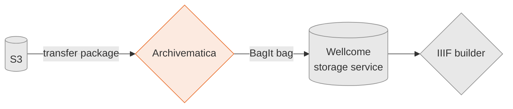

# archivematica-infrastructure

Archivematica is a open-source service for processing born-digital archives.
This includes:

*   Identifying file formats
*   Scanning for viruses
*   Adding fixity checksums

It then creates a BagIt bag, which it sends to [our storage service] for permanent storage.
The bag includes a [METS file], which can be used by iiif-builder to construct a IIIF Presentation manifest to describe this archive.

Archivematica is an open-source application created by [Artefactual].
We run a lightly modified version that adds support for our storage service.

This repo contains everything that defines our Archivematica deployment.

[our storage service]: https://github.com/wellcomecollection/storage-service
[METS file]: https://en.wikipedia.org/wiki/Metadata_Encoding_and_Transmission_Standard
[Artefactual]: https://www.artefactual.com/

---

## Environments

We run two instances of Archivematica:

*   A ["prod" environment][prod] that holds our real collections
*   A ["staging" environment][staging] that we use for testing and development

Each instance of the Archivematica is completely separate, and talks to a [separate instance of the storage service][storage_environments].
They don't share any files or storage.

[prod]: https://en.wikipedia.org/wiki/Deployment_environment#Production
[staging]: https://en.wikipedia.org/wiki/Deployment_environment#Staging
[storage_environments]: https://github.com/wellcomecollection/storage-service#usage

## Our Archivematica repositories

Our Archivematica code is split across three repositories:

*   This repo - infrastructure definitions in Terraform
*   [wellcomecollection/archivematica](https://github.com/wellcomecollection/archivematica) – a forked version of the Artefactual repo.
    Originally this fork diverged more substantially from the Artefactual repo when we were adding support for OpenID Connect; at this point the difference is slight and we'll probably switch to using code from upstream.
*   [wellcomecollection/archivematica-storage-service](https://github.com/wellcomecollection/archivematica-storage-service) – a forked version of the Artefactual repo.
    This fork adds support for the [Wellcome storage service](https://github.com/wellcomecollection/storage-service) to Archivematica.

## Other documentation

You might find these docs helpful:

*   [Troubleshooting](docs/troubleshooting.md) -- notes on problems we've seen in our deployment, and how to fix them.
*   [Authentication with Azure AD](docs/authentication.md) -- notes on how staff log in to Archivematica.
*   [Bootstrapping a stack](docs/bootstrapping.md) -- how we set up a fresh instance of Archivematica.

## Lambda development

The `s3_start_transfer` lambda initiates an Archivematica transfer when a file is uploaded to the watched Archivematica bucket (set up as an S3 transfer source in the Archivematica storage service).

If changes need to be made to the lambda, it can be tested with `make lambda-test` and then republished to s3 as a zipfile with `make lambda-publish`. A redeployment will be necessary so that Terraform can pick up the newly published lambda zipfile and upload it to the lambda service.

## Testing your changes to Archivematica

Once you've deployed a new version of Archivematica, you may want to test your changes by running a transfer package.

1.  In the workflow account, find the Lambda **archivematica-start_test_transfer-staging** (or prod).
2.  Run this Lambda.
    This will upload a new package to the Archivematica hot folder.
3.  Follow the progress of the package on the dashboard at <https://archivematica.wellcomecollection.org/transfer/>
