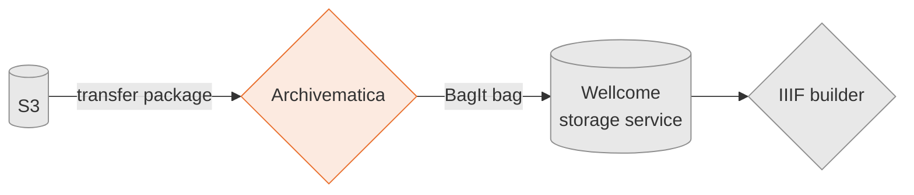

# archivematica-infrastructure

This is the configuration for our Archivematica deployment.

Archivematica is an open-source service for processing born-digital archives, which we use to:

*   Analyse files in the archive – including virus scanning, file format identification, and fixity checking
*   Create a metadata description of the archive that can be read by downstream applications
*   Upload the archive to our permanent cloud storage

The original application was created by [Artefactual], and we run a lightly modified fork.

[Artefactual]: https://www.artefactual.com/

## Requirements

Our deployment is designed to:

*   Allow archivists to manage our born-digital collections
*   Ensure our born-digital collections are processed consistently and stored safely
*   Avoid "reinventing the wheel" when processing born-digital archives

## High-level design

The user uploads a "transfer package" to an S3 bucket.
This contains the born-digital files, plus some metadata.

Anything that gets uploaded to this bucket is sent to Archivematica for processing.
It does its checking and analysis, and creates a [METS file] which describes the contents of the archive.
This becomes part of the BagIt bag, which is uploaded to [our storage service].

Successfully stored archives are then sent to iiif-builder, which uses the METS file to construct a IIIF Presentation manifest to describe this archive.
(If we can make the archive publicly available.)

[our storage service]: https://github.com/wellcomecollection/storage-service
[METS file]: https://en.wikipedia.org/wiki/Metadata_Encoding_and_Transmission_Standard

## Documentation

We have [documentation](./docs) about our Archivematica deployment, which includes:

*   How-to guides explaining how to do common operations, e.g. create a new transfer package
Reference material explaining how the storage service works
Notes for developers who want to modify or extend the storage service

## Usage

We run two instances of Archivematica at Wellcome:

*   A ["prod" environment][prod] that holds our real collections
*   A ["staging" environment][staging] that we use for testing and development

Each instance of the Archivematica is completely separate, and talks to a [separate instance of the storage service][storage_environments].
They don't share any files or storage.

We distinguish between two categories of born-digital archive:

*   Catalogued collections, which have been appraised by an archivist and have a catalogue reference (e.g. PP/MDM/A/3/1a).
    These go in the `born-digital` space in the storage service.
*   Accessions, which is an uncatalogued collection of files received from a donor.
    These have an [accession number][accno] (e.g. 1234), and go in the `born-digital-accessions` space in the storage service.

[prod]: https://en.wikipedia.org/wiki/Deployment_environment#Production
[staging]: https://en.wikipedia.org/wiki/Deployment_environment#Staging
[storage_environments]: https://github.com/wellcomecollection/storage-service#usage
[accno]: https://en.wikipedia.org/wiki/Accession_number_(cultural_property)

## License

This repository includes some code from the Archivematica repository, which is licensed from Artefactual under AGPL v3.0.
There are separate LICENSE files in the root of trees that contain AGPL code.

The remainder of the repository is released under the MIT license.
