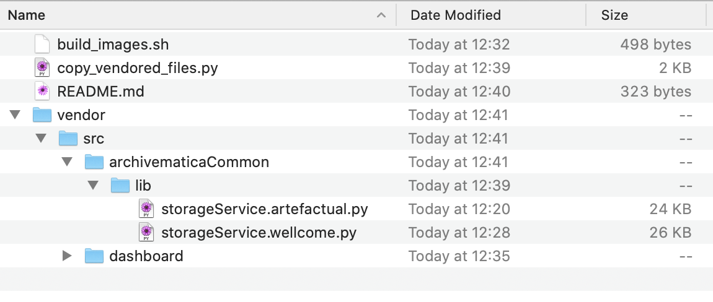

# archivematica

This folder creates the following images:

*   dashboard
*   MCPClient
*   MCPServer

We only diverge slightly from Archivematica upstream, so rather than maintaining a whole separate fork, we have a series of overlays.

## How to build images

Run the `build_images.sh` script.

You can get a newer version of the code from Artefactual upstream by changing the `ARCHIVEMATICA_TAG` variable.

## How the overlay works

The overlay is designed to balance a few competing concerns:

*   We want to diverge from the upstream Artefactual code in a handful of places, with changes that are unlikely to be accepted upstream
*   We don't want to maintain a completely separate Archivematica fork
*   We want to be able to upgrade to new versions of Archivematica

The overlay is best explained with an example:

This represents a Wellcome-specific version of the file `src/archivematicaCommon/lib/storageService.py` in the core Archivematica repo.
When we build the Docker image, these files replace the upstream versions.

We keep both the upstream and Wellcome-specific copy in the tree so that we can easily see how we've diverged.
This also allows us to maintain the divergence if the upstream code changes, because we can see what our changes from the original were.
