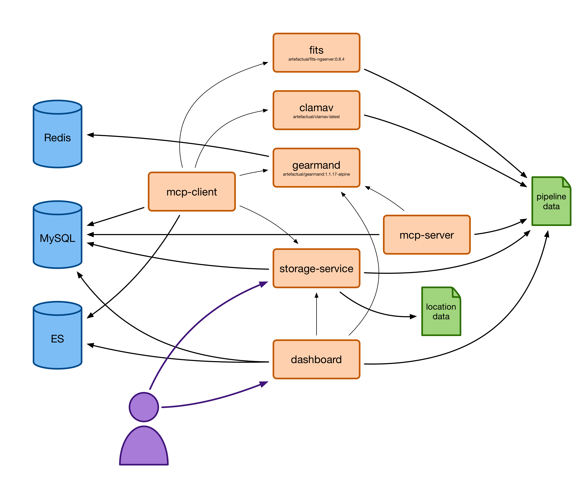

# Introduction

Archivematica is an open-source service for processing born-digital archives, which we use to:

* Analyse files in the archive – including virus scanning, file format identification, and fixity checking
* Create a metadata description of the archive that can be read by downstream applications
* Upload the archive to our permanent cloud storage

The original application was created by [Artefactual](https://www.artefactual.com/), and we run a lightly modified fork.

This GitBook space contains information about our Archivematica deployment, including:

* How-to guides explaining how to do common operations, e.g. create a new transfer package
* Reference material explaining how the storage service works
* Notes for developers who want to modify or extend the storage service

It supplements the information in [the first-party Archivematica docs](https://www.archivematica.org/en/), by adding information specific to Wellcome’s deployment.\
\

### User guides

These are guides on how to **use** Archivematica -- if you want to store born-digital packages.

There are also guides in SharePoint and GitBook.

There are three steps to storing some born-digital files in Archivematica:

1. [Create a transfer package](howto/create-a-transfer-package.md)
2. [Upload a transfer package to S3](storing-born-digital-files/upload-a-transfer-package-to-s3.md)
3. [Check a transfer package is stored](storing-born-digital-files/check-a-transfer-package-is-stored.md)

You can also \[download a package from storage service].

If you need to use the Archivematica dashboard, you can:

* \[Log in to the dashboard]
* \[Follow a package through the dashboard]
* [Add or remove users](howto/add-or-remove-users.md)

### Developer guides

Design principles:

* [How Archivematica is different to our other services](developers/how-archivematica-is-different.md)
* [Why do we fork Archivematica? How do our forks work?](developers/archivematica-forks.md)

Reference material:

* The OAIS model
* [What are the Archivematica apps?](developers/archivematica-apps.md)
* What are our services?
* [How we handle external identifiers](developers/external-identifiers.md)

How to:

* [How we run Archivematica](developers/how-we-run-archivematica.md)
* \[How to deploy new images?]
* [troubleshooting](developers/troubleshooting.md)
* \[Setting up SSO]
* [Bootstrapping a new instance of Archivematica](developers/bootstrapping.md)
* \[End-to-end testing]
* [SSH into the Archivematica container hosts](howto/ssh-into-container-hosts.md)

***

### Lambda development

The `s3_start_transfer` lambda initiates an Archivematica transfer when a file is uploaded to the watched Archivematica bucket (set up as an S3 transfer source in the Archivematica storage service).

If changes need to be made to the lambda, it can be tested with `make lambda-test` and then republished to s3 as a zipfile with `make lambda-publish`. A redeployment will be necessary so that Terraform can pick up the newly published lambda zipfile and upload it to the lambda service.

### Testing your changes to Archivematica

Once you've deployed a new version of Archivematica, you may want to test your changes by running a transfer package.

1. In the workflow account, find the Lambda **archivematica-start\_test\_transfer-staging** (or prod).
2. Run this Lambda. This will upload a new package to the Archivematica hot folder.
3. Follow the progress of the package on the dashboard at [https://archivematica.wellcomecollection.org/transfer/](https://archivematica.wellcomecollection.org/transfer/)

***

## archivematica-infra

These docs are intended for platform developers who are setting up our Archivematica instance or writing new features for Archivematica. They are _not_ intended for people who are _using_ Archivematica.

You might find the Artefactual docs helpful: [https://www.archivematica.org/en/docs/archivematica-1.8/](https://www.archivematica.org/en/docs/archivematica-1.8/)

### Architecture of services

Last updated: 4 March 2019.

We run Archivematica as a series of containers in ECS. I started from the [docker-compose.yml](https://github.com/artefactual-labs/am/blob/9567e9578a85fd10657cb815fb2714dbb5caa333/compose/docker-compose.yml), which gave me an idea of what containers, volumes, and data stores I need to run:

In the docker-compose definition:

* The orange boxes are containers
* The green documents are shared volumes
* The blue databases are shared data stores (running in other containers)

An arrow indicates that X depends on Y in the docker-compose definition.

For deploying on ECS:

* We're deploying each container in its own task, and using ECS service discovery to expose them all to each other
* We're using EFS mounted on EC2 hosts for the shared volumes
* We're using Amazon Elasticache, Amazon RDS, and Elastic Cloud for the shared data stores

The Docker images for the core Archivematica services (mcp-client, mcp-server, storage-service and dashboard) are built and automatically published from the `wellcome-storage-service` branch in our forks of the Archivematica repos.

### Deploying new services

If you want to deploy a new version of a service:

* Push a new version of your code to the `wellcome-storage-service` branch in the appropriate repo
* Wait for Travis to build your branch (which publishes a new image to ECR)
  * MCP client/server, dashboard: [https://travis-ci.org/wellcometrust/archivematica/branches](https://travis-ci.org/wellcometrust/archivematica/branches)
  * Storage service: [https://travis-ci.org/wellcometrust/archivematica-storage-service/branches](https://travis-ci.org/wellcometrust/archivematica-storage-service/branches)
* Inside this repo, run `make tf-plan` and then `make tf-apply`.

If you don't want to wait for Travis, you can deploy a service manually from the appropriate repo:

* wellcometrust/archivematica fork:
  * Dashboard \~> `make dashboard-publish`
  * MCP client \~> `make mcp_client-publish`
  * MCP server \~> `make mcp_server-publish`
* wellcometrust/archivematica-storage-service fork:
  * Storage service \~> `make archivematica-storage-service-publish`

### Known issues

*   When you do a fresh deployment, we don't bootstrap the database tables or run database migrations -- right now you have to SSH into the EC2 instance, exec into the container, and run the migration/table creation manually. We should do that automatically.

    Tracked by [https://github.com/wellcometrust/platform/issues/3471](https://github.com/wellcometrust/platform/issues/3471)
