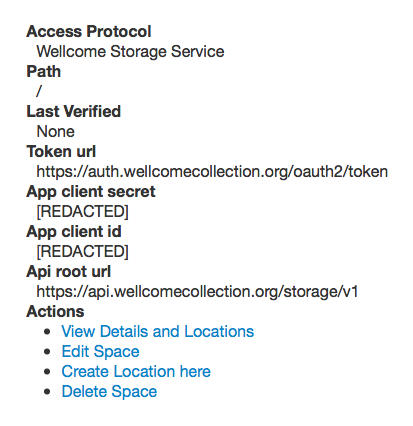
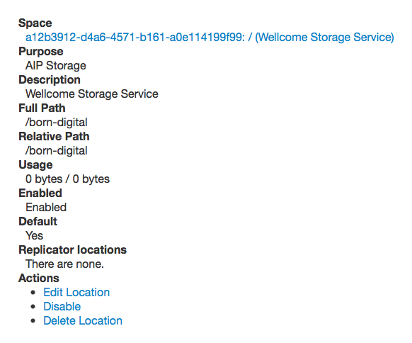

# Bootstrapping a new Archivematica stack

At time of writing, we run two Archivematica instances:

* The _production_ instance writes into the production Wellcome Archival Storage. This is accessible at [https://archivematica.wellcomecollection.org](https://archivematica.wellcomecollection.org). You should use this for everything you want to keep.
* The _staging_ instances writes into the staging Wellcome Archival Storage. This is accessible at [https://archivematica-stage.wellcomecollection.org](https://archivematica-stage.wellcomecollection.org). This is used for experiments, testing Archivematica, and so on. Don't use this for anything you want to keep long-term.

These are the steps for creating a new stack.

1. [Create a new ACM certificate (maybe)](#step1)
2. [Create a new Terraform stack](#step2)
3. [Create the Archivematica databases](#step3)
4. [Run the Django database migrations](#step4)
5. [Create initial users](#step5)
6. [Connect to the Wellcome Archival Storage](#step6)
7. [Connect to the transfer source bucket](#step7)
8. [Configure the local filesystem storage](#step8)
9. [Set up the default processing configuration](#step9)

## 1. Create a new ACM certificate (maybe) <a href="#step_1" id="step_1"></a>

You need two hostnames for an Archivematica instance:

* Dashboard, e.g. `https://archivematica.wellcomecollection.org` or `https://archivematica-stage.wellcomecollection.org`
* Storage service, e.g. `https://archivematica-storage-service.wellcomecollection.org` or `https://archivematica-storage-service-stage.wellcomecollection.org`

The existing certificate is defined in the `infra` Terraform stack.

If you're adding a new hostname, you'll need to create a certificate that covers these hostnames -- be careful not to accidentally delete the existing certificate, which would break the production Archivematica instance.

## 2. Create a new Terraform stack <a href="#step_2" id="step_2"></a>

Each Archivematica instance has two Terraform stacks:

* The "critical\_NAME" stack creates S3 buckets and databases. Anything stateful goes in here.
* The "stack\_NAME" stack creates the services, load balancers, and so on, that read from the databases.

You need to create the critical\_NAME stack first, then stack\_NAME. Make sure to change the config values before you plan/apply!

## 3. Create the Archivematica databases <a href="#step_3" id="step_3"></a>

When you first create your Archivematica stack, you'll notice that none of the tasks stay up for very long. If you look in the logs, you'll see them crashing with this error:

> OperationalError: (1049, "Unknown database 'MCP'")

To fix this:

1. SSH into one of the EC2 container hosts. This gets you inside the security group that connects to RDS.
2.  Start a Docker container and install MySQL:

    ```
    $ docker run -it alpine sh
    # apk add --update mariadb-client
    ```
3.  Open a MySQL connection to the RDS instance, using the outputs from the critical\_NAME stack:

    ```
    mysql \
      --host=$HOSTNAME \
      --user=archivematica \
      --password=$PASSWORD
    ```

    Run the following MySQL command:

    ```
    CREATE DATABASE SS;
    CREATE DATABASE MCP;
    ```

## 4. Run the Django database migrations <a href="#step_4" id="step_4"></a>

Once the databases have been created, we need to run Django migrations.

To fix this:

1. SSH into the EC2 container hosts.
2.  Run the Django migrations in the dashboard:

    ```
    docker exec -it $(docker ps | grep dashboard | grep app | awk '{print $1}') python /src/src/dashboard/src/manage.py migrate
    ```

    It might take a couple of attempts before this finishes successfully. The dashboard can't start until the database is set up correctly, which means it fails load balancer healthchecks -- ECS will be continually restarting the container until you successfully run the database migrations.
3.  Look for a Docker container running the storage service. Similar to above:

    ```
    docker exec -it $(docker ps | grep storage-service | grep app | awk '{print $1}') python /src/storage_service/manage.py migrate
    ```

## 5. Create initial users <a href="#step_5" id="step_5"></a>

When you see the dashboard and storage service are both running (you get a login page if you visit their URLs), you can create the initial users.

Create a storage service user:

```
docker exec -it $(docker ps | grep storage-service | grep app | awk '{print $1}') \
    python /src/storage_service/manage.py \
    create_user \
    --username="admin" \
    --password="PASSWORD" \
    --email="wellcomedigitalworkflow@wellcome.ac.uk" \
    --api-key="SS_API_KEY" \
    --superuser
```

Create a dashboard user:

```
docker exec -it $(docker ps | grep dashboard | grep app | awk '{print $1}') \
    python /src/src/dashboard/src/manage.py install \
    --username="admin" \
    --password="PASSWORD" \
    --email="wellcomedigitalworkflow@wellcome.ac.uk" \
    --org-name="wellcome" \
    --org-id="wellcome" \
    --api-key="API_KEY" \
    --ss-url="SS_HOSTNAME" \
    --ss-user="admin" \
    --ss-api-key="SS_API_KEY" \
    --site-url="DASHBOARD_HOSTNAME"
```

## 6. Connect to the Wellcome Archival Storage <a href="#step_6" id="step_6"></a>

This step tells Archivematica how to write to the Wellcome Archival Storage.

1. Log in to the Archivematica Storage Service (e.g. at [https://archivematica-storage-service.wellcomecollection.org/](https://archivematica-storage-service.wellcomecollection.org/)).
2. Select "Spaces" in the top tab bar. Click "Create new space".
3.  Select the following options:

    **Access Protocol:** Wellcome Storage Service

    **Path:** `/`

    **Staging path:** `/var/archivematica/sharedDirectory/wellcome-storage-service`\
    Used as a temporary area for transfers to/from the remote service

    **Token url / Api root url / App client id / App client secret**\
    Details of the Wellcome storage service

    **Access Key ID / Secret Access Key / Assumed AWS IAM Role**\
    AWS auth details, shouldn't be needed when running with ECS task roles

    **Bucket:**\
    `wellcomecollection-archivematica-ingests`\
    `wellcomecollection-archivematica-staging-ingests`\
    This is where the Wellcome storage plugin will place files for the WSS. It will then notify the storage service of this location so it can pick them up.

    **Callback host:**\
    [https://archivematica-storage-service.wellcomecollection.org/](https://archivematica-storage-service.wellcomecollection.org/)\
    [https://archivematica-storage-service-stage.wellcomecollection.org/](https://archivematica-storage-service-stage.wellcomecollection.org/)

    **Callback username / api key:** a username and API key for the AMSS so the callback from WSS can authenticate
4.  Click "Create location here".

    The purpose is **AIP Storage** and the relative path is `/born-digital`.

    (This will be concatenated onto the space path to produce a full path to which files should be uploaded. This does not correspond to a filesystem path, but maps to a location on the eventual storage. e.g. `/born-digital/` will map to the `born-digital` space in the Archival Storage.)

Here's what a successfully configured space looks like:



and location:



## 7. Connect to the transfer source bucket <a href="#step_7" id="step_7"></a>

This step tells Archivematica how to read uploads from the S3 transfer bucket.

1. Log in to the Archivematica Storage Service (e.g. at [https://archivematica-storage-service.wellcomecollection.org/](https://archivematica-storage-service.wellcomecollection.org/)).
2. Select "Spaces" in the top tab bar. Click "Create new space".
3.  Select the following options:

    **Access protocol:** S3

    **Path:** `/`

    **Staging path:** `/var/archivematica/sharedDirectory/s3_transfers`\
    Used as a temporary area for transfers to/from S3

    **S3 Bucket:**\
    `wellcomecollection-archivematica-transfer-source`\
    `wellcomecollection-archivematica-staging-transfer-source`\
    This is where the Wellcome storage plugin will place files for the WSS. It will then notify the storage service of this location so it can pick them up.
4.  Click "Create new location here".

    The purpose is **Transfer Source**.

    Give it a description of "S3 transfer source" or similar.

    The relative path corresponds to the name of the drop directory (within the root path) into which files should be dropped and an automated transfer started on Archivematica. It must match the name of a workflow on Archivematica (with dashes replaced by underscores, e.g. born-digital directory will trigger a transfer using the born\_digital flow)

    You need to create locations for `/born-digital` and `/born-digital-accessions`.

## 8. Configure the local filesystem storage <a href="#step_8" id="step_8"></a>

1.  Log in to the Archivematica Storage Service (e.g. at [https://archivematica-storage-service.wellcomecollection.org/](https://archivematica-storage-service.wellcomecollection.org/)).
2.  Select "Spaces" in the top tab bar. The first space should have "Access Protocol: Local Filesystem". Click "Edit Space".
3.  Select the following options:

    **Path:** `/`

    **Staging path:** `/`

If these are not set, you may get "No space left on device" errors when trying to process larger packages; see [archivematica-infrastructure#128](https://github.com/wellcomecollection/archivematica-infrastructure/issues/128).

## 9. Set up the default processing configuration <a href="#step_9" id="step_9"></a>

1. Log in to the Archivematica Dashboard (e.g. at [https://archivematica.wellcomecollection.org/](https://archivematica.wellcomecollection.org/)).
2. Select "Administration" in the top tab bar. Select "Processing configuration" in the sidebar.
3.  Set the following settings in the "Default" configuration:

    data

    | Scan for viruses                                                         | Yes                  |
    | ------------------------------------------------------------------------ | -------------------- |
    | Assign UUIDs to directories                                              | No                   |
    | Generate transfer structure report                                       | No                   |
    | Perform file format identification (Transfer)                            | Yes                  |
    | Perform policy checks on originals                                       | No                   |
    | Examine contents                                                         | Examine contents     |
    | Perform file format identification (Ingest)                              | No, use existing     |
    | Generate thumbnails                                                      | No                   |
    | Perform policy checks on preservation derivatives                        | No                   |
    | Perform policy checks on access derivatives                              | No                   |
    | Bind PIDs                                                                | No                   |
    | Document empty directories                                               | No                   |
    | Transcribe files (OCR)                                                   | No                   |
    | Perform file format identification (Submission documentation & metadata) | No                   |
    | Select compression algorithm                                             | Gzipped tar          |
    | Select compression level                                                 | 1 - fastest mode     |
    | Store AIP location                                                       | Wellcome AIP storage |
    | Upload DIP                                                               | Do not upload DIP    |

    All other fields should be "None".
4.  Create a "born\_digital" config, with the settings above and additionally:

    | Extract packages                   | No                                        |
    | ---------------------------------- | ----------------------------------------- |
    | Perform policy checks on originals | No                                        |
    | Create SIP(s)                      | Create single SIP and continue processing |
    | Normalize                          | Do not normalize                          |
    | Add metadata if desired            | Continue                                  |
    | Store AIP                          | Yes                                       |
5.  Create a "b\_dig\_accessions" config, with the default settings above and additionally:

    processing

    | Extract packages                   | No                             |
    | ---------------------------------- | ------------------------------ |
    | Perform policy checks on originals | No                             |
    | Create SIP(s)                      | Create single SIP and continue |
    | Normalize                          | Do not normalize               |
    | Add metadata if desired            | Continue                       |
    | Store AIP                          | Yes                            |
