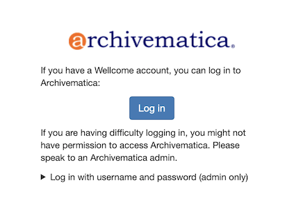
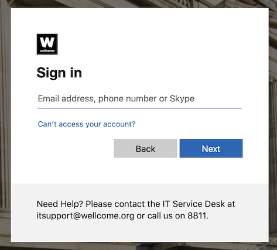

# Authentication with Azure AD

Our Archivematica instance relies on Azure AD for user authentication.

## How login looks for the user

Here's how the login flow works:

1.  A user goes to log in to Archivematica, and clicks the button that takes them to Azure AD:

    

    (Note: this screen is one of the changes in our Archivematica fork.
    We deliberately emphasise SSO over the username/password login.)

2.  This sends the user to the standard Wellcome AD login screen:

    

    The user logs in with their standard Wellcome username/password.

3.  The user gets redirected back to Archivematica, where they're now able to access the Archivematica dashboard.
