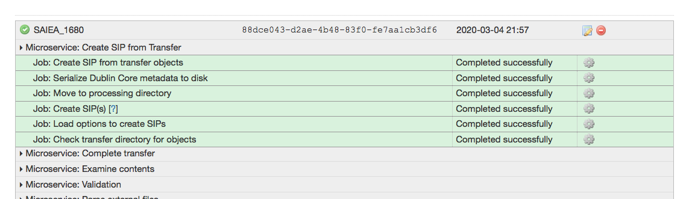
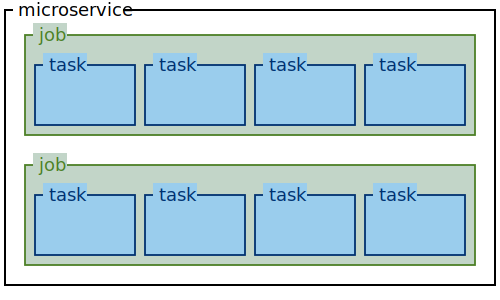
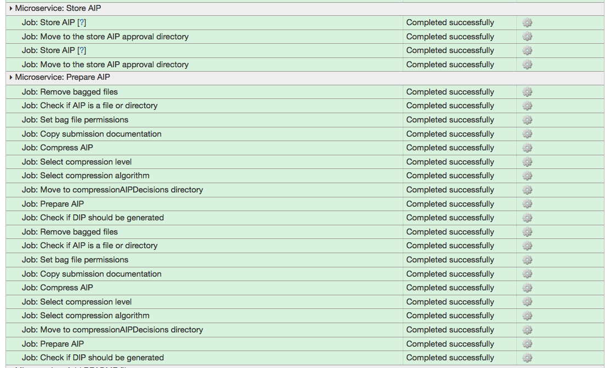
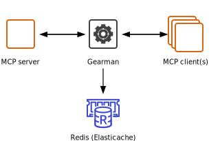

# Conceptual bits that are useful for debugging Archivematica

This page has some notes on conceptual bits that were useful as I was setting up/debugging our Archivematica deployment.
Some of it is specific to Wellcome, some of it is general Archivematica knowledge.

## Microservices/tasks/jobs

There are three units of "work" in Archivematica, which you can see in the Archivematica UI:

The top level unit is the *microservice*, for example `Create SIP from Transfer`.

Each microservice runs a number of *jobs*.
Each job is doing a different action – for example, `Check transfer directory for objects` or `Load options to create SIPs`.

Each job may spawn one or more *tasks*, which are the Python scripts that run under the hood.
You can see the tasks by clicking the gear icon.
Often tasks run on a per-file basis: if there are 100 files in a transfer package and you need to perform an action on each file, there would be 100 tasks.

Microservices contain jobs, jobs spawn tasks:

Sometimes actions get stuck and need to be restarted; the only way I know how to do this is to restart the Archivematica containers (more on that below).
Doing this may cause weird things to happen:

*   When the job is re-run, it gets scheduled twice, which might cause interesting things to happen downstream.
    Here's an example: this ingest had failed at the `Prepare AIP` step, I restarted the containers, and every job in and after Prepare AIP was run twice:

    

*   Not all tasks tolerate being run twice, e.g. they try to create a directory and fail if the directory already exists (from a previous run of the task).

## The role of Gearman, Elasticache, and the MCP server/client

Archivematica also has microservices in the sense we use them in the rest of the platform: independent containers running in ECS.

The *MCP server* is a scheduler written as part of Archivematica.
It decides what tasks (in the sense described above) need to be run.
It tells the *Gearman server* about these tasks.

*Gearman* is [an open-source framework](http://gearman.org/) for distributing tasks between machines.
It uses Redis as a database to track the in-flight tasks, which in our case is an instance of Amazon hosted Elasticache.

The *MCP client* picks up tasks from Gearman, and actually does the work -- for example, moving a file from A to B.
It then reports the results back to Gearman.
You can have multiple instances of the MCP client, and the computational resources available to each client are a dominant factor in the speed of processing in Archivematica.
At time of writing (March 2020), we run two instances of the MCP client.

So the lifecycle of a task is as follows:

*   The MCP server schedules a task, and sends it to Gearman
*   Gearman forwards the task to an MCP client
*   The MCP client performs the task, and reports the result back to Gearman
*   Gearman forwards the result to the MCP server, which then displays the result in the dashboard, and decides what task to run next

If a task appears to be stuck:

*   Restarting the MCP client tends to be okay.
    Not all tasks cope with being restarted – if the task doesn't expect to be run twice, you may fail the entire transfer/ingest; if so, you just have to retry the whole thing, sorry.

*   Restarting the MCP server is more disruptive, and seems to cause all in-flight transfers/ingests to be dropped.
    I've seen it get stuck once or twice, but it's unusual.

*   Restarting the Gearman server is probably fine (all the data should be in Redis), but I've never tried it.
    Gearman has been pretty robust and never been the source of issues.
