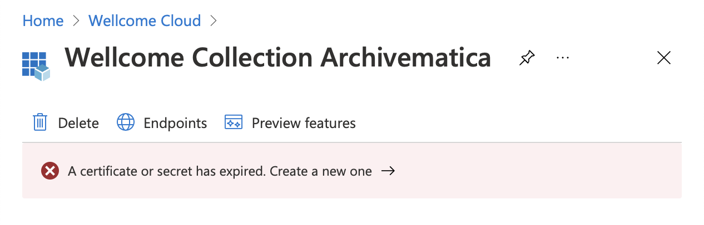

# "Unauthorized for url" when logging in

In October 2021, we saw issues logging into Archivematica. Logged-in users would see an internal server error in the dashboard, and we saw this error in the logs:

> HTTPError: 401 Client Error: Unauthorized for url: https://login.microsoftonline.com/3b7a675a-1fc8-4983-a100-cc52b7647737/oauth2/v2.0/token

This means the Archivematica client secret in Azure AD has expired. You can tell this is the case when you log into the [Azure portal](https://portal.azure.com/#blade/Microsoft\_AAD\_RegisteredApps/ApplicationMenuBlade/Overview/appId/8dccdaeb-e67e-417f-bebc-7aab4abade28/isMSAApp/) and see this screen:

<figure><figcaption></figcaption></figure>

If so, follow the instructions [to regenerate the Azure AD secrets](../../azure\_ad\_login/).
