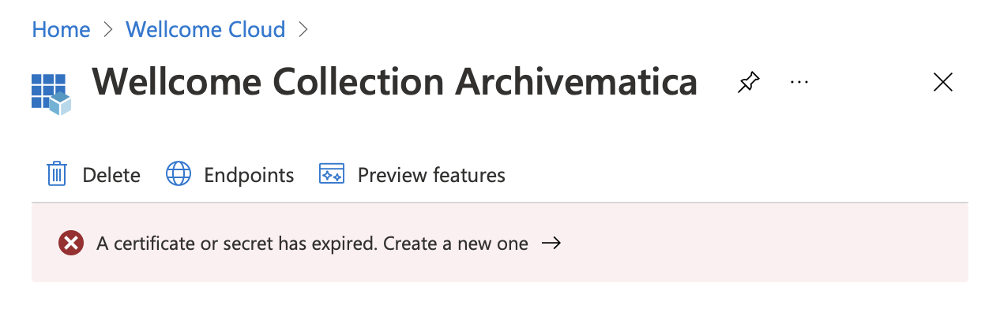

# "Unauthorized for url" when logging in

In October 2021, we saw issues logging into Archivematica. Logged-in users would see an internal server error in the dashboard, and we saw this error in the logs:

> HTTPError: 401 Client Error: Unauthorized for url: https://login.microsoftonline.com/3b7a675a-1fc8-4983-a100-cc52b7647737/oauth2/v2.0/token

This can mean that the Archivematica client secret is missing, incorrect, or expired.
Confirm that expiry is the cause by looking for an Azure error such as `AADSTS7000222` in the logs or by checking the credential expiry in the [Azure portal](https://portal.azure.com/#blade/Microsoft\_AAD\_RegisteredApps/ApplicationMenuBlade/Overview/appId/8dccdaeb-e67e-417f-bebc-7aab4abade28/isMSAApp/).

<figure><figcaption></figcaption></figure>

If the secret has expired, follow the instructions [to regenerate the Azure AD secrets](https://github.com/wellcomecollection/archivematica-infrastructure/tree/main/azure_ad_login).
