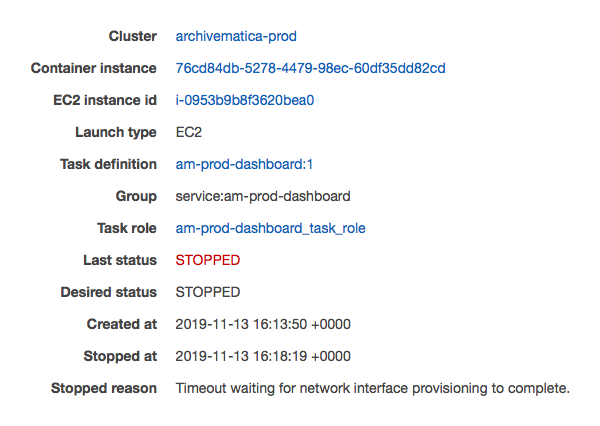

# Timeout waiting for network interface provisioning to complete

You may see this error in the ECS console as the reason a task stopped (or rather, failed to start):

<figure><figcaption></figcaption></figure>

This means that ECS timed out while provisioning networking for a new task.
The stopped-task reason does not identify the underlying cause.

Do not terminate the EC2 container host. Each environment has a single container host which is managed directly by Terraform, and there is no Auto Scaling Group which will replace a terminated instance.

Inspect the stopped task and the ECS service events, then check the available IP addresses in the target subnets, the container instance's available network-interface capacity, and whether the ECS agent is connected to the cluster.
ECS services retry failed task placement automatically, so confirm whether a replacement task reaches `RUNNING` before intervening.
If failures continue and the evidence points to the ECS agent or container host, wait until no transfers or ingests are running and reboot the existing EC2 instance without terminating it.
A reboot interrupts the services which run on the host and any work held in Gearman's in-memory queue.

After the instance restarts, confirm that the EBS volume is mounted at `/ebs`, the container instance is connected to the ECS cluster, and the services return to their expected task counts.
