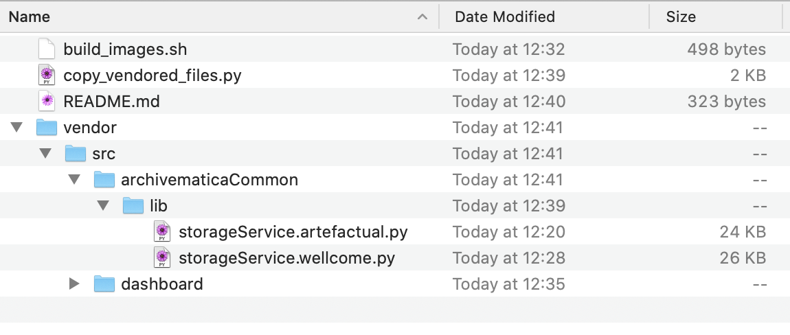

# Why do we fork Archivematica? How do our forks work?

We fork Archivematica to add support for our storage service.
We've considered adding support to the upstream code (and deleting our forks), but this is non-trivial:

*   It means adding a new dependency to Archivematica (our storage service client library), which Artefactual are understandably reluctant to do.

*   Archivematica is designed to work with a variety of storage backends (e.g. S3, DuraCloud, Fedora), and our storage service is a bit of an "odd one out".

    Most of the storage backends can store packages very quickly, whereas our storage service is asynchronous and can sometimes take multiple hours to successfully store a package.
    We've had to change some of the code around timeouts and waiting for the storage backend.

## How our forks work / how overlays work

Previously we maintained two completely separate copies of the Archivematica repositories (artefactual/archivematica and archivematica-storage-service), but because we only modify a handful of files we've replaced them with "overlays" that live in this repository.

The overlay works as follows:

1.  Clone the upstream Artefactual repository
2.  Copy our "overlay" files into the clone
3.  Run the `docker build` command inside the clone-plus-overlay

The overlay is designed to balance a few competing concerns:

*   We only want to diverge from the upstream Artefactual code in a handful of places
*   We don't want the overhead of a separate Archivematica fork
*   We want to be able to update to new versions of Archivematica

The overlay is best explained with an example:

This represents a Wellcome-specific version of the file `src/archivematicaCommon/lib/storageService.py` in the core Archivematica repo.
When we build the Docker image, these files replace the upstream versions.

We keep both the upstream and Wellcome-specific copy in the tree so that we can easily see how we've diverged.
This also allows us to maintain the divergence if the upstream code changes, because we can see what our changes from the original were.

## Updating to newer versions of Archivematica

Because we only fork in a handful of places, we should be able to update to newer Archivematica versions relatively easily.

It should be sufficient to bump the version of the Artefactual repo that we clone.
