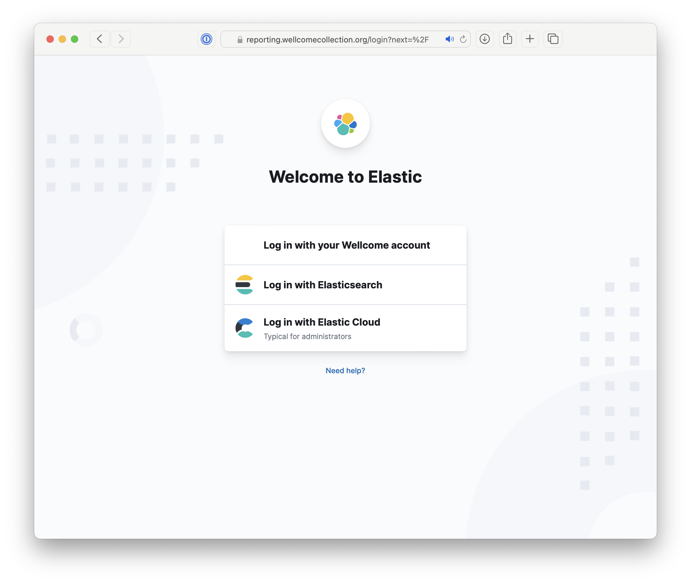
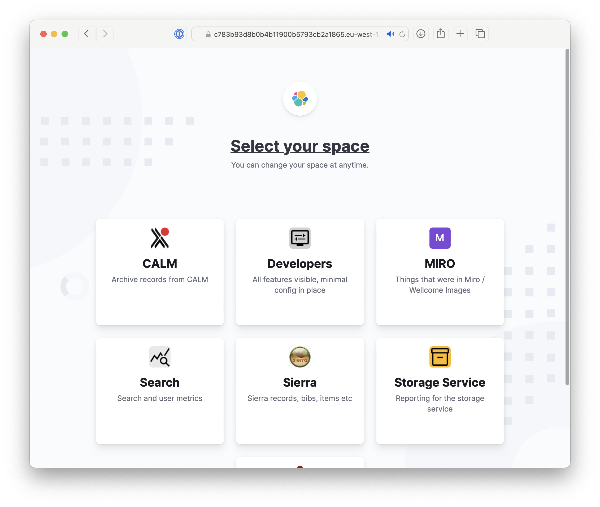
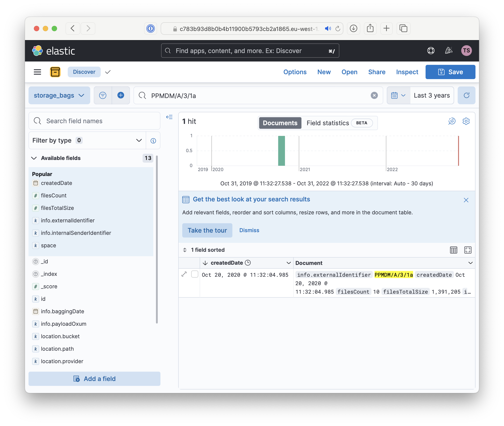

# How to check a transfer package is stored

Go to <reporting.wellcomecollection.org>, and select "Login with your Wellcome account".
Log in with your usual Active Directory credentials.

Select the "Storage Service" space:

Search for a bag with the same identifier (either catalogue reference or accession number) as your transfer package.
You may need to extend the time range with the calendar picker in the top right.

If you find a result with:

*   a matching `info.externalIdentifier` matches
*   a `createdDate` from after you uploaded your transfer package to S3

then your transfer package has been stored successfully.

If your transfer package doesn't appear within a day, then ask a developer to look at the Archivematica logs in the `#wc-preservation-feedback` channel in Slack.
