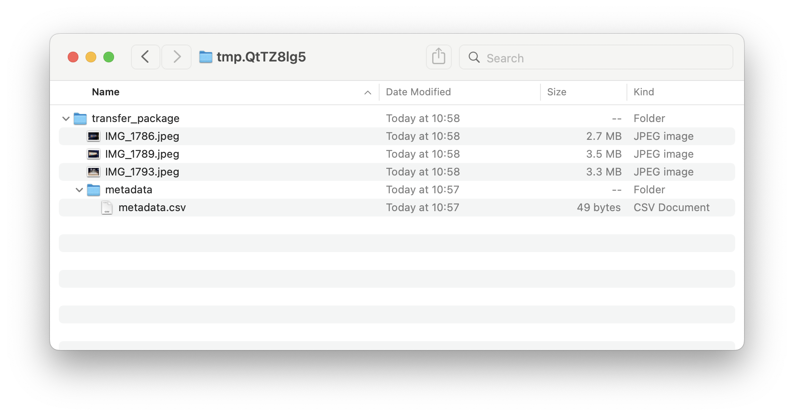

# How to create a transfer package

A **transfer package** is a zip file containing the born-digital files you want to store, plus some metadata.

The files can be in any structure, including folders and subfolders.



The metadata files **must** be stored in a top-level folder called `metadata`.

## Metadata files

There are two metadata files, both of which are stored:

*   `metadata.csv`, which contains the catalogue identifier.


    ```
    filename,dc.identifier
    objects/,PP/MDM/A/3/1a
    ```

filename,dc.identifier,wellcome.storageSpace
objects/,archivematica-dev/TEST/1,testing
