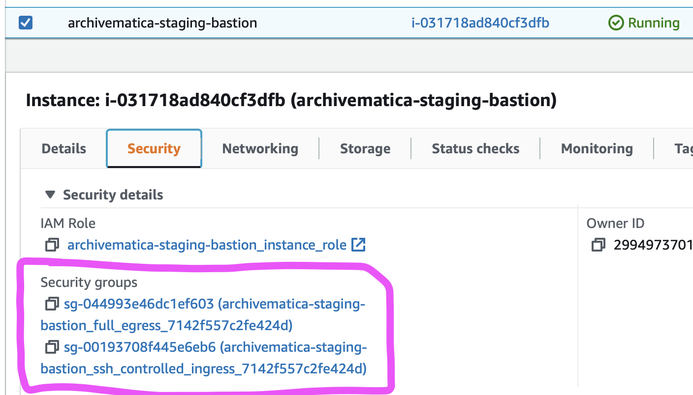
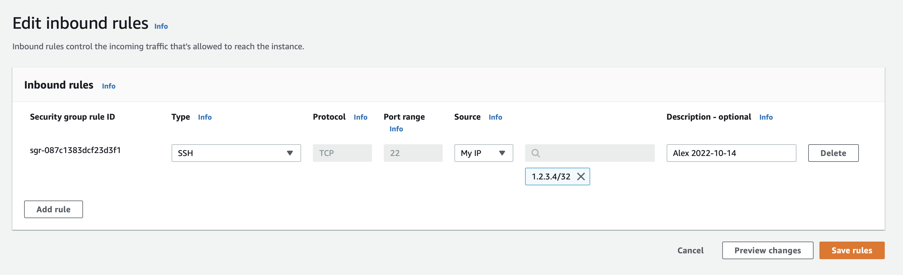

# SSH into the Archivematica container hosts

It can be useful to SSH into the Archivematica container hosts for debugging.

There's [an unmaintained script](https://github.com/alexwlchan/pathscripts/blob/ef34c4f4dd32403bade2a304751458fbddd27412/ssh_to_archivematica), or you can follow the instructions below.

The Archivematica container hosts aren't connected directly to the Internet; instead you have to go through the bastion host.
There are only a handful of EC2 instances in the workflow account:

Steps:

1.  Identify the container/bastion hsot pair you want to SSH into.
    Let's suppose I want to log into the staging instance.

    

2.  Select the bastion instance, then the "Security" tab.
    There should be two security groups:

    *   full egress (which allows all outbound traffic from the instance)
    *   SSH controlled ingress (which filters inbound traffic to the instance)

    

3.  Select the SSH controlled ingress security group.
    In the security group console, add an inbound rule that allows SSH from your current IP address.
    Add your name and the current date to provide an audit trail.

    

4.  Find the DNS names of the instances:

    *   the public DNS name of the bastion instance
    *   the private DNS name of the container instance

5.  SSH through the instances.
    I feel like there's probably a way to do this a single tunneling command, but I find it easier to move keys around:

    ```shell
    # Upload the SSH key to the bastion instance
    scp -i key_on_local ec2-user@BASTION_HOST:key_on_bastion

    # SSH into the bastion instance
    ssh -i key_on_local ec2-user@BASTION_HOST

    # SSH from the bastion instance into the private instance
    # (on the bastion)
    ssh -i key_on_bastion ec2-user@CONTAINER_HOST
    ```
