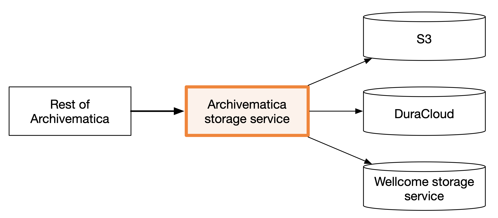

# What are the Archivematica apps?

Archivematica is made up of seven different apps. This is a brief summary of those apps, and how they apply to our use case.

*   **dashboard** – the interface to Archivematica. This includes both the graphical component (i.e. the web dashboard) and the Archivematica API.

    It's used by humans to monitor the state of Archivematica transfers, and for machines to manage transfers.
* **storage service** – another term for this might be "storage orchestrator" or "storage adapter". It provides a common interface to various storage backends, e.g. S3, DuraCloud, DSpace, so the rest of Archivematica can interact with various storage backends. This is where we've added code to interact with our storage service.

<figure><figcaption></figcaption></figure>

*   **MCP services** – these are the tasks that do the actual processing in Archivematica. I don't fully understand the distinction, but here's what I understand:

    * MCP Server decides what tasks need to be performed. It uses Gearman and Redis to store persistent information about tasks, to survive e.g. a restart.
    * MCP Client gets tasks from MCP Server (possibly via Gearman), and actually does the work. It may use other containers to help do its work, in particular FITS (for file format identification) and ClamAV (for virus scanning).

    <figure><figcaption></figcaption></figure>
