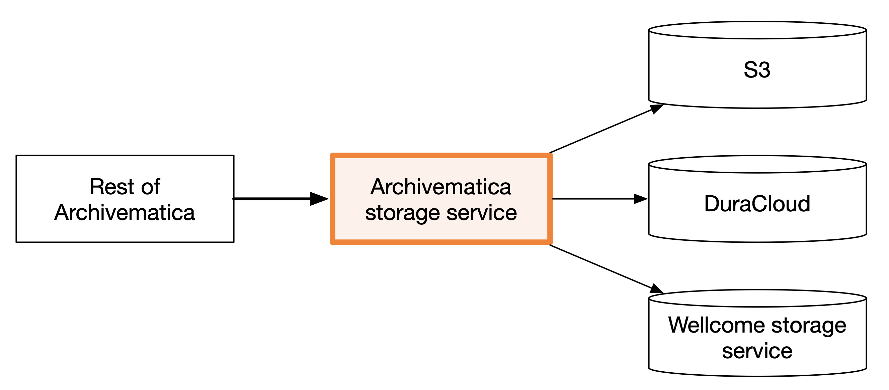

# The Archivematica apps

Our deployment contains four Archivematica applications and several supporting services.
This is a brief summary of the parts which are important for our use case.

*   **dashboard** – the interface to Archivematica. This includes both the graphical component (i.e. the web dashboard) and the Archivematica API.

    It's used by humans to monitor the state of Archivematica transfers, and for machines to manage transfers.
* **storage service** – another term for this might be "storage orchestrator" or "storage adapter". It provides a common interface to various storage backends, e.g. S3, DuraCloud, DSpace, so the rest of Archivematica can interact with various storage backends. This is where we've added code to interact with our storage service.

<figure><figcaption></figcaption></figure>

* **MCP server** – decides what work needs to be performed, records it in MySQL, and submits jobs to Gearman.
* **Gearman** – distributes jobs from the MCP server to the MCP clients. Its queue is held in memory and does not survive a restart.
* **MCP client** – performs the work requested by the MCP server. We run multiple clients so several tasks can be processed at once.
* **ClamAV** – scans files for viruses. It runs separately in Fargate, and the MCP clients stream files to it rather than sharing a filesystem with it.

The dashboard, Storage Service, MCP server, MCP clients, and Gearman run as ECS tasks on a single EC2 container host.
The dashboard and Storage Service each have an Nginx sidecar, while ClamAV runs as a Fargate service.

See [Gearman and the MCP server/client](gearman-and-the-mcp-server-client.md) for more detail about how Archivematica schedules processing work.

