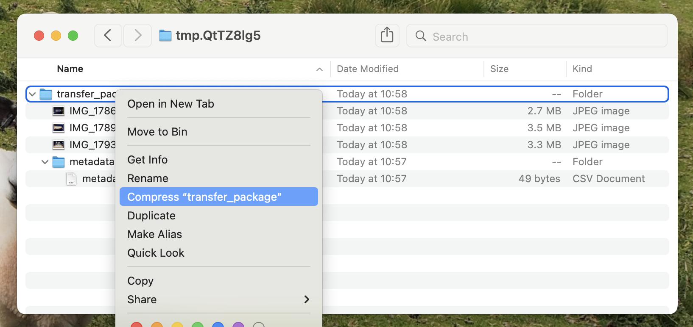
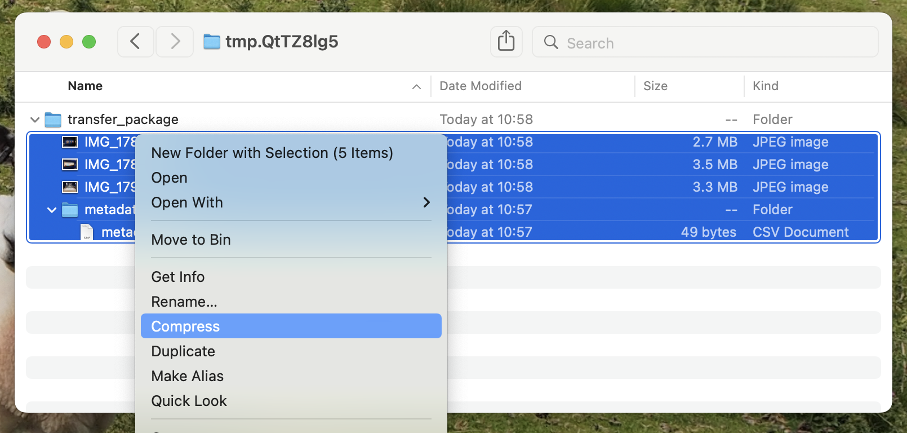

# Creating a transfer package

A **transfer package** is a zip file containing the born-digital files you want to store, plus some metadata.

The files can be in any structure, including folders and subfolders.


The metadata files **must** be stored in a top-level folder called `metadata`.

## Metadata files

We use two metadata files in our transfer packages.
Both files must use UTF-8 encoding:

*   `metadata.csv`, which contains the identifier.

    If it's a catalogued package, the CSV should have two columns and the catalogue identifier in `dc.identifier`:

    ```csv
    filename,dc.identifier
    objects/,PP/MDM/A/3/1a
    ```

    If it's an accession, the CSV should have three columns and the accession number in `accession_number`:

    ```csv
    filename,collection_reference,accession_number
    objects/,SA/TIH,2314_2
    ```

    In both cases, the CSV only ever has `objects/` as the filename.
*   `rights.csv`, which is optional and describes the rights attached to individual files.

    The file must use UTF-8 without a byte-order mark (BOM).
    The file must have a header row and at least one row of rights information.
    Every row must have a `file` and `basis` value.
    The `file` must identify a file in the transfer package and use its Archivematica path, beginning with `objects/`.
    The supported bases are `copyright`, `donor`, `license`, `other`, `policy`, and `statute`.

    For a copyright basis, `status`, `jurisdiction`, `note`, `grant_act`, and `grant_note` are also required.
    The `note` must be `In copyright` or `All Rights Reserved` because the IIIF manifest builder uses it as a controlled rights code.
    Copyright rows may also have `determination_date`, `start_date`, and `end_date` values.
    A copyright `end_date` cannot be `open`; leave the value empty for no end date.
    For a donor, other, or policy basis, rows may have `start_date`, `end_date`, and `note` values.
    For a license basis, `note`, `grant_act`, and `grant_note` are also required.
    The `note` must be `CC-0`, `CC-BY`, `CC-BY-NC`, `CC-BY-NC-ND`, `CC-BY-SA`, `CC-BY-NC-SA`, `OGL`, `OPL`, or `PDM` because the IIIF manifest builder uses it as a controlled licence code.
    License rows may also have `start_date`, `end_date`, and `terms` values.
    For a statute basis, `citation` and `jurisdiction` are required.
    Statute rows may also have `determination_date`, `start_date`, `end_date`, and `note` values.
    Basis-specific fields not listed for the selected basis must be empty because Archivematica would discard them.
    If any grant information other than `grant_act` is supplied, `grant_act` must have a value because Archivematica otherwise discards the grant details.
    The optional `grant_restriction` must be `allow`, `conditional`, or `disallow` when supplied.
    It is required when `grant_start_date` or `grant_end_date` is supplied because Archivematica cannot include grant dates in the PREMIS rights statement without a restriction.
    If any documentation identifier information is supplied, both `doc_id_type` and `doc_id_value` must have values.
    The `doc_id_role` value is optional.
    Each combination of `file`, `basis`, and `grant_act` may appear only once.
    Surrounding whitespace is ignored for all three values, while letter case is ignored for `basis` and `grant_act`; file paths remain case-sensitive.

    The optional columns are `status`, `determination_date`, `start_date`, `end_date`, `jurisdiction`, `terms`, `citation`, `note`, `grant_act`, `grant_restriction`, `grant_start_date`, `grant_end_date`, `grant_note`, `doc_id_type`, `doc_id_value`, and `doc_id_role`.
    No other columns are accepted.

    For example, this applies an in-copyright statement to a file:

    ```csv
    file,basis,status,jurisdiction,note,grant_act,grant_note
    objects/reports/summary.pdf,copyright,copyrighted,GB,In copyright,disseminate,Open
    ```

## Compressing the package

The files **must** be in the top-level of the zip; there can't be an enclosing folder.

| ❌                                                                                                                                    | ✅                                                                                                                                  |
| ------------------------------------------------------------------------------------------------------------------------------------ | ---------------------------------------------------------------------------------------------------------------------------------- |
|  |  |

## See also

[Transfer in the Archivematica documentation](https://www.archivematica.org/en/docs/archivematica-1.13/user-manual/transfer/transfer/#prepare-transfer) – we use the "zipped directory" transfer type.
