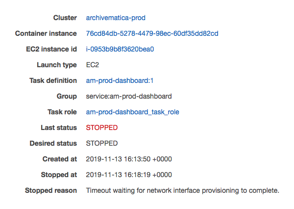

# Troubleshooting

This document has some notes on errors seen in our Archivematica deployment, and how to fix them:

*   [Timeout waiting for network interface provisioning to complete](#timeout_provisioning)

<h2 id="timeout_provisioning">
  Timeout waiting for network interface provisioning to complete
</h2>

You may see this error in the ECS console as the reason a task stopped (or rather, failed to stop):

This means that when the EC2 container host tries to place a new task, something goes wrong when it sets up the networking.
This can happen if the same task has been stopped and restarted repeatedly.

The easiest fix is to terminate the EC2 container hosts, and wait for them to be restarted by the autoscaling group.
