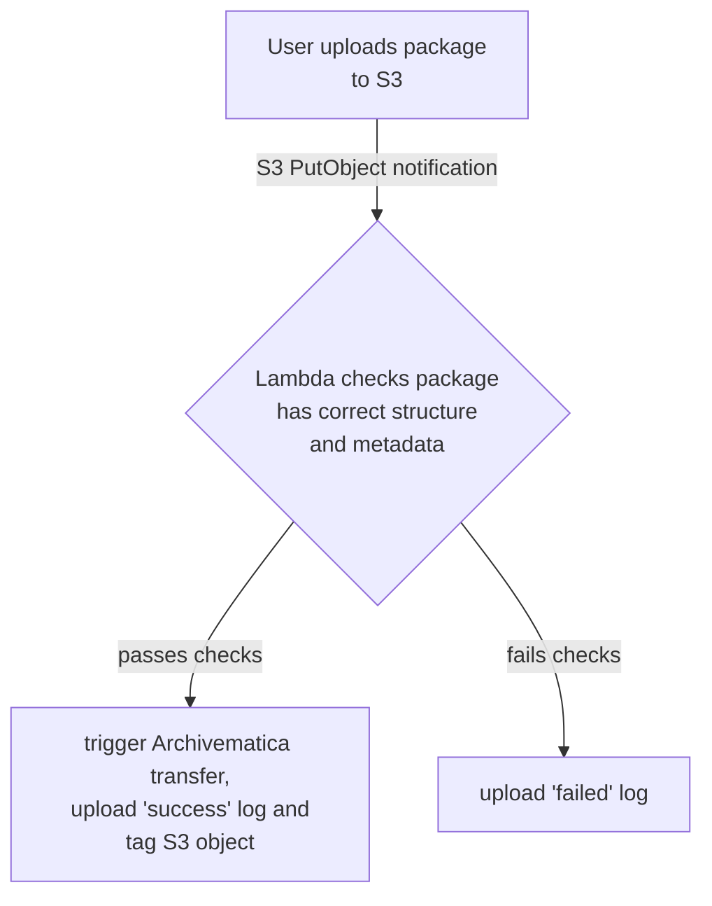

# s3_start_transfer

This Lambda allows archivists to start processing a transfer package with Archivematica by uploading it to S3.

A transfer package is a zip file containing the files, plus some metadata (including our catalogue reference and/or accession number).



When a user uploads a package to the "transfer source" S3 bucket, this Lambda is triggered by a bucket notification.
It then runs a series of checks on the Lambda, e.g.:

*   does it have a `metadata.csv` in the right place?
*   does the `metadata.csv` have the right fields?
*   is the package structured correctly?

It records a success/fail result by uploading a small log file alongside the original file, which includes instructions if the transfer package is rejected -- so users can diagnose issues without leaving S3.

If it starts a transfer successfully, it tags the S3 object with the transfer ID.


## Deployment

This Lambda is automatically deployed with the latest version whenever you apply Terraform in `stack_staging` or `stack_prod`.


## Running tests

```console
$ coverage run -m py.test src/test_*.py
$ coverage report
```


## Debugging notes

*   If you see a 401 Response from the Archivematica storage service in the CloudWatch Logs, check the API keys in the Lambda config are up-to-date.

*   If you get an "unable to find location" error, such as:

    ```
    Unable to find location for wellcomecollection-archivematica-staging-transfer-source:MS5520.zip: StoragePathException
    Traceback (most recent call last):
      File "/var/task/s3_start_transfer.py", line 200, in main
        target_path = get_target_path(bucket, directory, key_path)
      File "/var/task/s3_start_transfer.py", line 118, in get_target_path
        return find_matching_path(s3_sources["objects"], bucket, directory, key)
      File "/var/task/s3_start_transfer.py", line 150, in find_matching_path
        raise StoragePathException("Unable to find location for %s:%s" % (bucket, key))
    s3_start_transfer.StoragePathException: Unable to find location for wellcomecollection-archivematica-staging-transfer-source:MS5520.zip
    ```

    The Lambda may be trying to initiate a transfer from part of the bucket which isn't configured as a transfer source in Archivematica.

    We should have two top-level folders configured as transfer sources: `/born-digital` and `/born-digital-accessions`.
    To fix, set up these folders as transfer sources.

    See the bootstrapping docs elsewhere in this repo.
