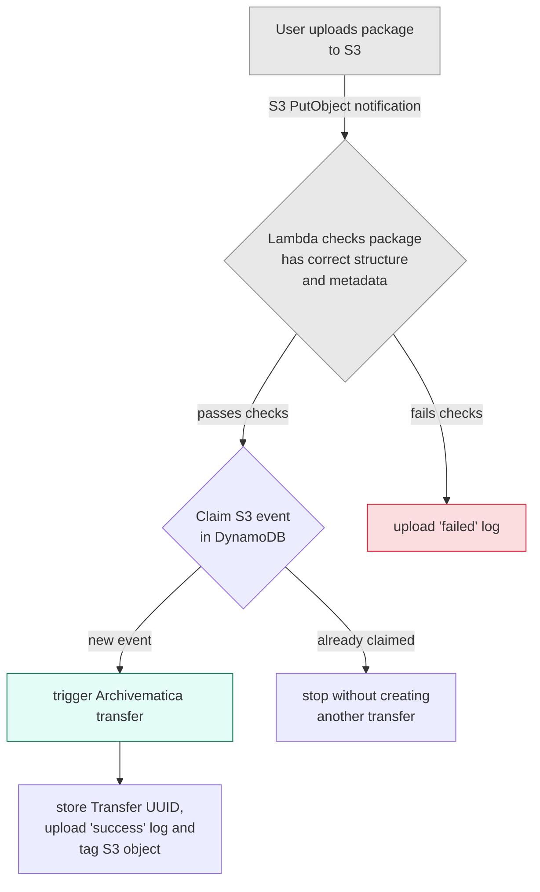

# s3_start_transfer

This Lambda tells Archivematica to process transfer packages which are uploaded to a "transfer source" S3 bucket.
A transfer package is a zip file containing the files, plus some metadata (including our catalogue reference and/or accession number).

*   For archivists, this means they can start processing a transfer package by uploading it to S3, rather than using the Archivematica dashboard.

*   For the platform team, this means we can do some checks on packages before they're sent to Archivematica (e.g. that the metadata has been supplied correctly).


## How it works


```mermaid
graph TD
    A[User uploads package<br/>to S3] -->|S3 PutObject notification| L{Lambda checks package<br/>has correct structure<br/>and metadata}
    L -->|passes checks| D{Claim S3 event<br/>in DynamoDB}
    D -->|new event| S[trigger Archivematica transfer]
    D -->|already claimed| X[stop without creating<br/>another transfer]
    S --> C[store Transfer UUID,<br/>upload 'success' log and<br/>tag S3 object]
    L -->|fails checks| F[upload 'failed' log]

    classDef failedNode fill:#e01b2f,stroke:#e01b2f,fill-opacity:0.15
    class F failedNode

    classDef successNode fill:#b0f7e2,stroke:#0b7051,fill-opacity:0.35
    class S successNode

    classDef genericNode fill:#e8e8e8,stroke:#8f8f8f
    class A,L genericNode
```

When a user uploads a package to the "transfer source" S3 bucket, this Lambda is triggered by a bucket notification.
It then runs a series of checks on the transfer package, e.g.:

*   does it have a `metadata.csv` in the right place?
*   does the `metadata.csv` have the right fields?
*   is the package structured correctly?

It records a success/fail result by uploading a small log file alongside the original file, which includes instructions if the transfer package is rejected -- so users can diagnose issues without leaving S3.

If it starts a transfer successfully, it tags the S3 object with the transfer ID.
These tags will be used by the (yet-to-be-written) transfer monitor Lambda to check for Archivematica failures and/or clean up the bucket.

## Idempotency

S3 and Lambda can deliver the same notification more than once.  Before calling
Archivematica, the Lambda conditionally writes the full S3 event identity to
DynamoDB.  The identity includes the bucket, decoded object key, event type,
sequencer, and version ID when present.  Only the invocation which creates the
record can call Archivematica.

The records have three states:

* `SUBMITTING` means the event has been claimed and the Archivematica result is
  not confirmed.
* `SUBMITTED` means Archivematica returned a Transfer UUID.  These records keep
  the UUID and receive a DynamoDB TTL approximately 90 days in the future.
* `UNKNOWN` means the Archivematica request raised after the event was claimed,
  so the outcome may be uncertain.

`SUBMITTING` and `UNKNOWN` records do not expire or retry automatically.  They
must be compared with the Archivematica dashboard and CloudWatch logs before an
operator changes or removes the record.  DynamoDB errors fail the Lambda
invocation and prevent an unclaimed request from reaching Archivematica.

The Transfer UUID is committed to DynamoDB before S3 tags and the success log
are written.  If either S3 operation fails afterwards, the Transfer will not be
created again on redelivery; use the DynamoDB record to repair the feedback
manually.  After DynamoDB eventually deletes a `SUBMITTED` record through TTL,
replaying that old notification could create another Transfer.


## Deployment

This Lambda is automatically deployed with the latest version whenever you apply Terraform in `stack_staging` or `stack_prod`.


## Running tests

```console
$ coverage run -m pytest tests
$ coverage report
```


## Debugging notes

*   If you see a 401 Response from the Archivematica storage service in the CloudWatch Logs, check the API keys in the Lambda config are up-to-date.

*   If you get an "unable to find location" error, such as:

    ```
    Unable to find location for wellcomecollection-archivematica-staging-transfer-source:MS5520.zip: StoragePathException
    Traceback (most recent call last):
      File "/var/task/s3_start_transfer.py", line 200, in main
        target_path = get_target_path(bucket, directory, key_path)
      File "/var/task/s3_start_transfer.py", line 118, in get_target_path
        return find_matching_path(s3_sources["objects"], bucket, directory, key)
      File "/var/task/s3_start_transfer.py", line 150, in find_matching_path
        raise StoragePathException("Unable to find location for %s:%s" % (bucket, key))
    s3_start_transfer.StoragePathException: Unable to find location for wellcomecollection-archivematica-staging-transfer-source:MS5520.zip
    ```

    The Lambda may be trying to initiate a transfer from part of the bucket which isn't configured as a transfer source in Archivematica.

    We should have two top-level folders configured as transfer sources: `/born-digital` and `/born-digital-accessions`.
    To fix, set up these folders as transfer sources.

    See the bootstrapping docs elsewhere in this repo.
