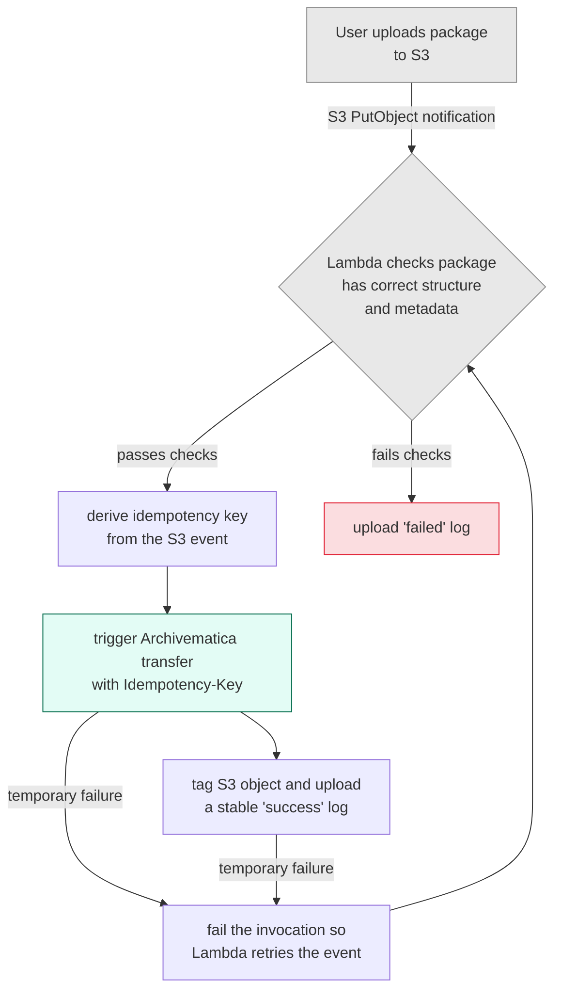

# s3_start_transfer

This Lambda tells Archivematica to process transfer packages which are uploaded to a "transfer source" S3 bucket.
A transfer package is a zip file containing the files, plus some metadata (including our catalogue reference and/or accession number).

*   For archivists, this means they can start processing a transfer package by uploading it to S3, rather than using the Archivematica dashboard.

*   For the platform team, this means we can do some checks on packages before they're sent to Archivematica (e.g. that the metadata has been supplied correctly).


## How it works


```mermaid
graph TD
    A[User uploads package<br/>to S3] -->|S3 PutObject notification| L{Lambda checks package<br/>has correct structure<br/>and metadata}
    L -->|passes checks| K[derive idempotency key<br/>from the S3 event]
    K --> S[trigger Archivematica transfer<br/>with Idempotency-Key]
    S --> C[tag S3 object and upload<br/>a stable 'success' log]
    S -->|temporary failure| R[fail the invocation so<br/>Lambda retries the event]
    C -->|temporary failure| R
    R --> L
    L -->|fails checks| F[upload 'failed' log]

    classDef failedNode fill:#e01b2f,stroke:#e01b2f,fill-opacity:0.15
    class F failedNode

    classDef successNode fill:#b0f7e2,stroke:#0b7051,fill-opacity:0.35
    class S successNode

    classDef genericNode fill:#e8e8e8,stroke:#8f8f8f
    class A,L genericNode
```

When a user uploads a package to the "transfer source" S3 bucket, this Lambda is triggered by a bucket notification.
It then runs a series of checks on the transfer package, e.g.:

*   does it have a `metadata.csv` in the right place?
*   does the `metadata.csv` have the right fields?
*   is the package structured correctly?

It records a success/fail result by uploading a small log file alongside the original file, which includes instructions if the transfer package is rejected -- so users can diagnose issues without leaving S3.

If it starts a transfer successfully, it tags the S3 object with the transfer ID.
The [transfer monitor Lambda](../transfer_monitor) uses these tags to report Archivematica successes and failures and remove successfully stored packages from the transfer bucket.

## Idempotency

S3 and Lambda can deliver the same notification more than once.
The Lambda derives a SHA-256 identity from the notification's bucket, decoded object key, event type, sequencer, and version ID when present.
It sends that identity to Archivematica in the `Idempotency-Key` header on every attempt.

Archivematica returns the original Transfer UUID when the same request and key are replayed, including when an earlier response was lost after the Transfer was accepted.
A genuine replacement upload has a new S3 sequencer or version ID, so it receives a new key and starts a new Transfer.

Archivematica transport errors, server errors, and retryable HTTP responses fail the invocation, as do failures writing S3 success feedback.
Lambda can then redeliver the event without creating another Transfer.
Permanent submission errors write a failed user log and do not retry.
Package tags include the stable S3 event time, and user log names include a readable event timestamp and an event identity suffix so a retry overwrites the same log instead of creating a duplicate.
Invalid packages and permanent transfer-source configuration errors also write a failed user log and do not retry.

The header is optional and ignored by older Archivematica versions, but deploying this retry behaviour with those versions is unsafe because an uncertain submission can create duplicate Transfers.
Deploy idempotency-aware Dashboard and MCPServer images before deploying this Lambda version in an environment.
Safe replay guarantees apply only when the request is handled by Dashboard and MCPServer versions which support idempotent package submission.
During a mixed-version rollout, attempts handled by an older instance can still create duplicate Transfers.
Newer Archivematica versions retain keys for 90 days, which covers Lambda retries and events retained in the Lambda dead-letter queue.


## Deployment

This Lambda is automatically deployed with the latest version whenever you apply Terraform in `stack_staging` or `stack_prod`.


## Running tests

The Lambda runs on Python 3.14. Install `uv`, then create a virtual environment
and install the locked test dependencies from this directory:

```console
$ uv venv --python 3.14
$ source .venv/bin/activate
$ uv pip sync test_requirements.txt
$ coverage run -m pytest
$ coverage report
```


## Maintaining test dependencies

`test_requirements.in` lists the direct test dependencies and
`test_requirements.txt` is the compiled lock file. Do not edit the lock file
directly. These dependencies are only used for local testing; Terraform does
not include them in the Lambda deployment package.

After changing `test_requirements.in`, or when upgrading all test dependencies,
regenerate the lock file for the Lambda's Python version:

```console
$ uv pip compile --python-version 3.14 --upgrade test_requirements.in --output-file test_requirements.txt
$ uv pip sync test_requirements.txt
$ coverage run -m pytest
```

To upgrade a single dependency while retaining the other locked versions, use
`--upgrade-package` instead:

```console
$ uv pip compile --python-version 3.14 --upgrade-package moto test_requirements.in --output-file test_requirements.txt
```


## Debugging notes

*   If you see a 401 Response from the Archivematica storage service in the CloudWatch Logs, check the API keys in the Lambda config are up-to-date.

*   If you get an "unable to find location" error, such as:

    ```
    Unable to find location for wellcomecollection-archivematica-staging-transfer-source:MS5520.zip: StoragePathException
    Traceback (most recent call last):
      File "/var/task/s3_start_transfer.py", line 200, in main
        target_path = get_target_path(bucket, directory, key_path)
      File "/var/task/s3_start_transfer.py", line 118, in get_target_path
        return find_matching_path(s3_sources["objects"], bucket, directory, key)
      File "/var/task/s3_start_transfer.py", line 150, in find_matching_path
        raise StoragePathException("Unable to find location for %s:%s" % (bucket, key))
    s3_start_transfer.StoragePathException: Unable to find location for wellcomecollection-archivematica-staging-transfer-source:MS5520.zip
    ```

    The Lambda may be trying to initiate a transfer from part of the bucket which isn't configured as a transfer source in Archivematica.

    We should have two top-level folders configured as transfer sources: `/born-digital` and `/born-digital-accessions`.
    To fix, set up these folders as transfer sources.

    See the bootstrapping docs elsewhere in this repo.
